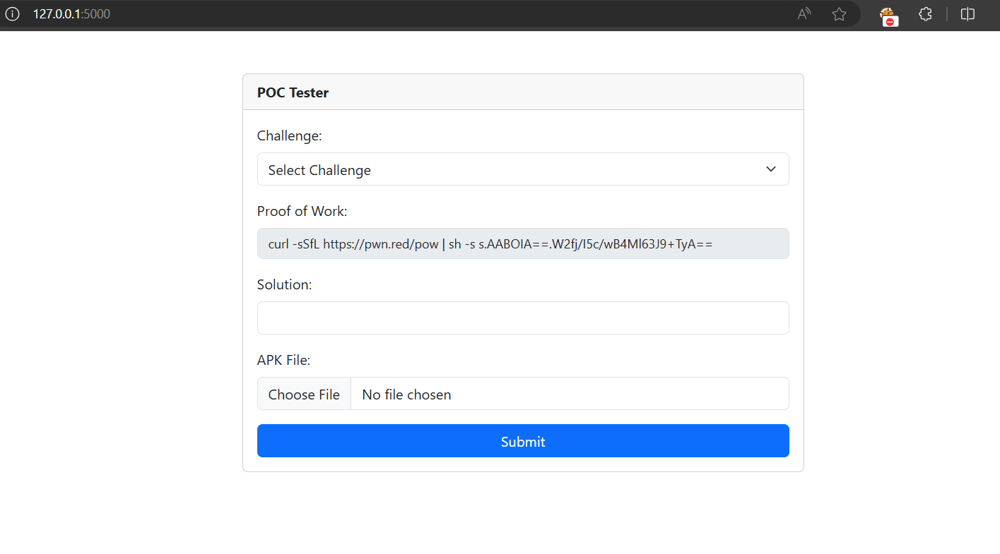

# Mobile POC Tester

This repository contains the mobile Proof of Concept (POC) tester for CTF challenges. The POC tester is a web application that allows users to test their POCs against a vulnerable Android application. It supports multiple challenges within a single Android emulator.

## Installation

To install the POC tester, follow these steps:

1. Clone the repository:

    ```bash
    git clone https://github.com/TCP1P/Mobile-POC-Tester.git
    ```

2. Navigate to the `Mobile-POC-Tester` directory:

    ```bash
    cd Mobile-POC-Tester
    ```

3. Run Docker Compose:

    ```bash
    docker compose up --build
    ```

4. Open your browser and go to port 5000:

    

## Usage

To use the POC tester, you can modify the folders inside the `challenges` directory. Each folder within the `challenges` directory represents a challenge that shares the emulator. Be careful when adding a challenge to ensure it does not conflict with or influence other challenge POCs. You can configure your application and Android behavior in `client.py`, and don't forget to place your APK file inside the folder. The POC tester will automatically install the APK when you start Docker. Here is the folder structure for a challenge:

```
.
├── challenges
│   └── <your challenge folder>
│       ├── *.apk
│       ├── *.apk
│       └── client.py
```

## Contributors

- [@aimardcr](https://github.com/aimardcr)
- [@dimasma0305](https://github.com/dimasma0305)
